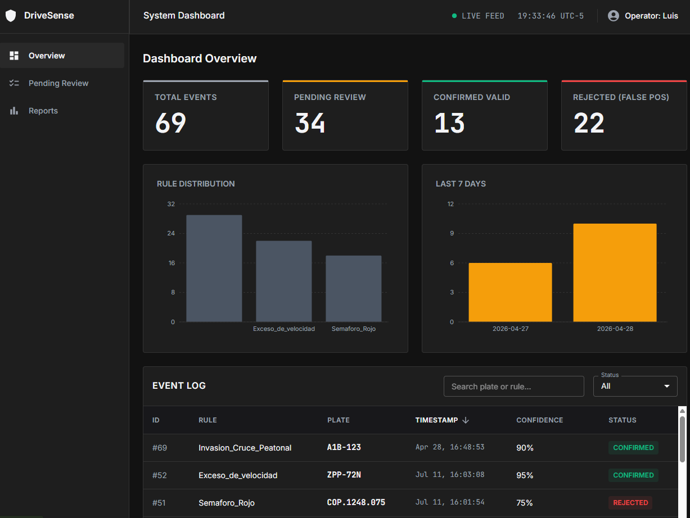
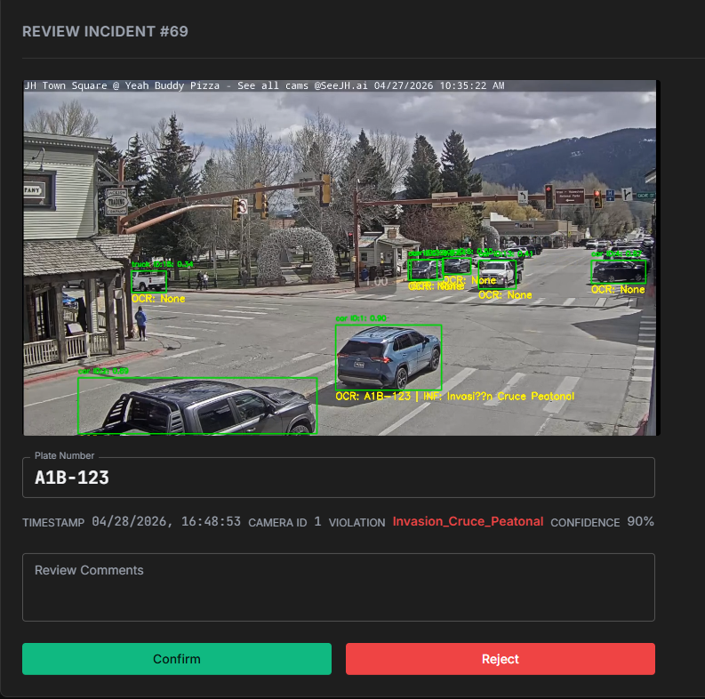

# DriveSense 🚦


**DriveSense** is an automated traffic infraction detection system that works in real-time. It uses YOLOv11 to track vehicles and evaluate traffic rules, like running a red light or blocking a crosswalk. When it detects a violation, it extracts the license plate using OpenAI's GPT-4o-mini API.

The system includes a web dashboard that allows traffic operators to review the recorded video evidence and validate or reject the infraction (a Human-in-the-Loop approach) before issuing a ticket.

## 📸 Interface


*Main dashboard showing real-time statistics and the infraction log.*


*Human-in-the-Loop validation interface where operators review the video clip and approve or reject the infraction.*

---

## ✨ Features

- **Real-Time Tracking:** Uses YOLOv11 and ByteTrack to follow multiple vehicles smoothly, even when occluded or parked.
- **Geometric Infraction Logic:** Evaluates traffic rules by mapping virtual lanes, stop lines, and crosswalks. It can tell if a vehicle ran a red light or if it stopped on a crosswalk based on zero-speed kinematics.
- **Smart Plate Extraction (OCR):** Combines a custom YOLO license plate model with OpenAI (GPT-4o-mini) for accurate OCR. API calls are strictly limited to confirmed infractions to optimize performance and reduce costs.
- **Evidence Recording:** Automatically extracts an H.264 video clip of the exact moment the infraction occurred, ensuring playback compatibility on web browsers.
- **Human-in-the-Loop Dashboard:** A responsive React web platform to validate evidence, generate PDF reports, and manage infraction states.

---

## 📂 Project Structure

```text
.
├── training/               # YOLO license plate detection model training
│   ├── dataset/            # Roboflow Dataset
│   └── train.py            # Training script
└── app/                    # DriveSense Application
    ├── edge/               # Real-time video processing pipeline
    ├── backend/            # FastAPI Backend
    ├── frontend/           # React + Vite Dashboard
    └── data/               # Local database and video evidence [Git ignored]
```

---

## 🛠️ Setup Instructions

### 0. Data Folder Setup (Important)

The `app/data/` folder is ignored by Git because it contains heavy video files and the local database. If you want to test the project, you need to set this up manually:

1. Create the data directory: `mkdir -p app/data/videos/`
2. Download the test videos from this [Google Drive Link](https://drive.google.com/drive/folders/1zUJ65Uv30SZ6P4ZIJ65hS6O_2xz_3hRT?usp=drive_link).
3. Place the downloaded videos inside `app/data/videos/`.
*(Note: The SQLite database `drivesense.db` will be created automatically when you run the system for the first time).*

### 1. Edge Processing (Real-Time Detection)

```bash
cd app
python -m venv venv
# Activate the virtual environment:
# On Windows: venv\Scripts\activate
# On Mac/Linux: source venv/bin/activate

pip install ultralytics opencv-python python-dotenv openai imageio imageio-ffmpeg

# Run the detector on a video
python edge/src/vehicle_detector.py --source data/videos/video_000.mp4
```

### 2. Backend (FastAPI)

Open a new terminal:

```bash
cd app/backend
# Make sure your virtual environment is activated
pip install -r requirements.txt
uvicorn app.main:app --reload
# API running at http://127.0.0.1:8000
```

### 3. Frontend (React Dashboard)

Open another terminal:

```bash
cd app/frontend
npm install
npm run dev
# Dashboard running at http://localhost:5173
```

---

## 🔐 Environment Variables

Create a `.env` file inside the `app/` folder. You will need an OpenAI API key for the OCR to work:

```env
OPENAI_API_KEY="sk-..."

# Optional (for email notifications/reports):
EMAIL_SENDER=""
EMAIL_PASSWORD=""
SMTP_SERVER=""
SMTP_PORT=587
```
